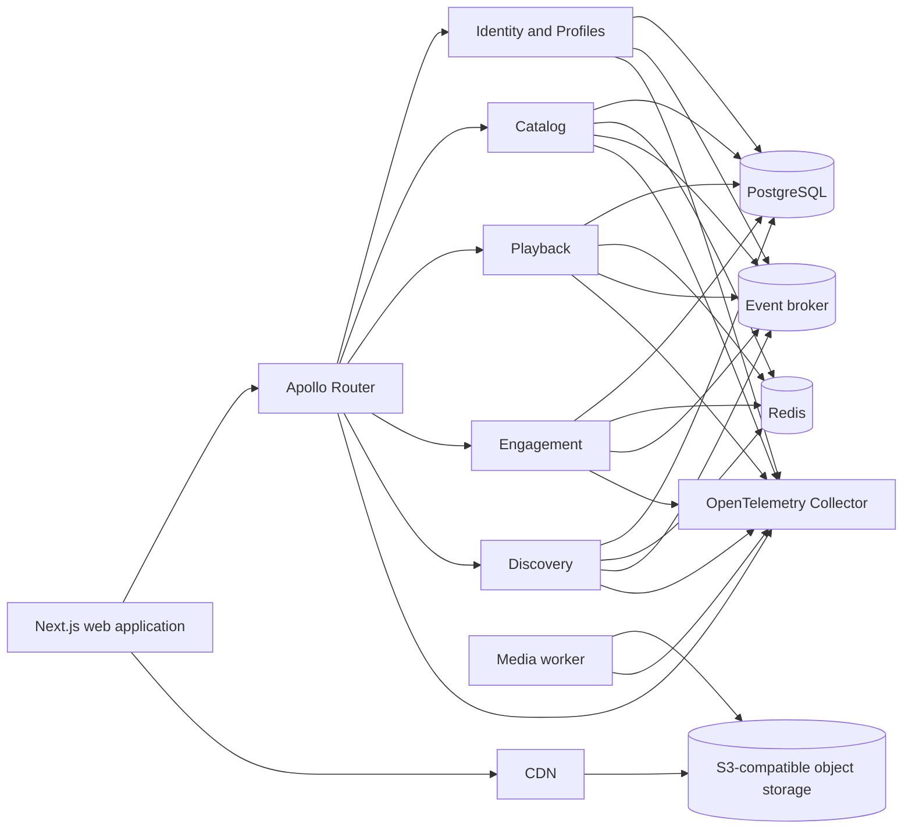

# Aster

Aster is a production-oriented video-on-demand platform for openly licensed films. It is designed as a complete engineering system rather than a collection of disconnected technical examples.

The repository begins with specifications. The implementation must remain traceable to product requirements, architecture decisions, measurable quality gates, and operational evidence.

## Current status

Phases 00–07 are released locally, including the accessible player and Docker-only playable demo. Phase 08's [owner-authorized engagement APIs and event delivery](services/engagement/README.md) have passed protected release. Player saving, resume and library integration pass local browser/Docker acceptance; their protected release remains pending. See [current state](.ai/CURRENT_STATE.md), [playback guide](apps/web/PLAYBACK.md), [Router](apps/router/README.md) and [Phase 08 evidence](evidence/phase-08/README.md).

Do not describe planned behavior as implemented behavior. The source of truth for current progress is [`.ai/CURRENT_STATE.md`](.ai/CURRENT_STATE.md).

## Run the playable Docker demo

With Git and Docker Engine 26.0.0+/Compose 2.26.1+, run from the repository root:

```bash
docker compose --project-name aster-demo --file infra/compose/compose.yml --file infra/compose/playable.yml --profile runtime up --build --wait --wait-timeout 180 web
```

Open [Aster](http://127.0.0.1:3000), choose **Signal / 02**, then **Watch title** and **Start playback**. This generates and publishes a six-second, captioned technical video through the real Catalog, Playback, Router and object-storage path. No host Node, pnpm, FFmpeg, manual SQL or account is required. First build needs registry access; ports 3000, 4000 and 9001 must be free. Use `127.0.0.1`, not `localhost`.

The explicit `web` target leaves optional profiles, Redis, broker and observability out. This generated sample is not a third-party film. Repeated startup verifies and reuses existing bytes and records. [Controls, limits, diagnostics and project-scoped stop/cleanup](apps/web/PLAYBACK.md).

To also enable local profiles, progress, history and watchlist on this disposable demo:

```bash
docker compose --project-name aster-demo --file infra/compose/compose.yml --file infra/compose/playable.yml --file infra/compose/events.yml --profile runtime up --build --wait --wait-timeout 180 web identity engagement broker-init
```

Use **Profiles → Start local session**, create/select a fictional profile, then watch the sample. Pause around two seconds and open **Your library** to resume it or inspect history/watchlist. This opt-in uses the existing PostgreSQL owners and broker; anonymous playback remains independent. [Personalized behavior and cleanup](apps/web/PLAYBACK.md#personalized-demo). Do not apply this fresh-demo command to an existing development database without its owner migration/backup procedure.

## Run the Docker Web demo

This earlier checkpoint demonstrates browsing and optional local profiles, without playable media. Use the playable command above for the streaming journey; do not run both projects on the same ports.

From the repository root, with Git and Docker Engine 26.0.0+/Compose 2.26.1+:

```bash
docker compose --project-name aster --file infra/compose/compose.yml --file infra/compose/demo.yml --profile runtime up --build --wait --wait-timeout 120
```

Open [Aster](http://127.0.0.1:3000). Browse the generated title, change its language, inspect attribution, and open Profiles to start a local session and create/select a fictional profile. No host Node, pnpm, FFmpeg or hosted account is required. The first build needs registry access; ports 3000 and 4000 must be free. Use `127.0.0.1`, not `localhost`, to preserve the exact local cookie/origin policy.

The overlay explicitly opts into the Catalog-owned technical seed after migrations. Repeating initialization preserves data and does not duplicate the seed. Modified or retired seed data fails closed instead of being overwritten. This is a browsing/profile demo, **not playable VOD**: the bundled measured report is reused, media URLs deliberately do not deliver video, and no third-party film is approved. [Web behavior, limits and recovery](apps/web/README.md).

## Run the Docker federated API checkpoint

From the repository root, with Git and Docker Engine 26.0.0+/Compose 2.26.1+:

```bash
docker compose --project-name aster --file infra/compose/compose.yml --profile runtime up --build --wait --wait-timeout 120
```

The GraphQL endpoint is `http://127.0.0.1:4000/graphql` (POST only, no interactive landing page). Docker builds from the frozen lockfile, applies owner migrations, initializes private per-owner Router credentials and starts Identity/Catalog/Playback/Engagement with restricted database logins. Playback has a separate Catalog read credential; Engagement has distinct private Identity and Playback read credentials. Their health ports stay private; inspect Docker health with the status command below. No host Node, pnpm, GraphOS account or hosted credential is needed. The first build needs registry access. This command does not yet start the [Web checkpoint](apps/web/README.md) or playable video; the current runtime proof covers Linux/WSL amd64, not every host/CPU combination.

Exercise sign-in, create/select/list/delete a synthetic profile and sign-out (POSIX/WSL, Docker only):

```bash
docker compose --project-name aster --file infra/compose/compose.yml exec -T identity node --input-type=module - --compose-router < tools/verify-local-identity.mjs
```

The check keeps credentials in memory and cleans up its own profile. It requires one free profile slot and available journal capacity; it never deletes existing profiles. [API operations, limits and recovery](services/identity/README.md).

For real metrics, Kafka and S3, start the optional full laboratory:

```bash
docker compose --project-name aster --file infra/compose/compose.yml --file infra/compose/observability.yml --profile full up --build --wait --wait-timeout 120
```

Open [Prometheus](http://127.0.0.1:9090) and query `process_memory_usage_bytes`, `nodejs_eventloop_delay_p99_seconds` or `aster_dependency_operation_outcomes_total`. Broker/storage remain internal; Collector failure does not make Identity unready. Smaller [profiles](docs/operations/LOCAL_DEVELOPMENT.md#optional-profiles) are available.

Stop all enabled Aster profiles while retaining named local data:

```bash
docker compose --project-name aster --file infra/compose/compose.yml --file infra/compose/observability.yml --file infra/compose/demo.yml --profile "*" down
```

Use the explicit reset below only to delete local data. [Runtime instructions and evidence](docs/operations/LOCAL_DEVELOPMENT.md#docker-runtime-checkpoint) cover limits and troubleshooting.

## Run the current foundation

The Phase 00 checkpoint validates the repository itself. It does not start an application, expose a URL, or require Docker. The current command results are recorded in the [Phase 00 evidence index](evidence/phase-00/README.md).

### Requirements

- Git;
- Node.js `24.19.0`, selected through `.nvmrc`, `.node-version`, or an equivalent version manager;
- Corepack from the supported Node.js distribution;
- registry access for the first package-manager provisioning, dependency install, and dependency audit.

Docker, FFmpeg, databases, and hosted credentials are not required for this checkpoint.

### Bootstrap a fresh checkout

Run these commands from a POSIX shell such as Linux, macOS, WSL, or the repository's CI environment:

```bash
git clone https://github.com/andrewsrigom/aster-streaming-platform.git
cd aster-streaming-platform
git config --local core.hooksPath .githooks
node --version
corepack enable
corepack install
pnpm --version
pnpm install --frozen-lockfile
pnpm toolchain:check
```

The local Git command activates the tracked repository hooks for this clone without changing user-global configuration. `node --version` must print `v24.19.0`, and `pnpm --version` must print `11.24.0`. The frozen install rejects lockfile drift. The toolchain check rejects an unsupported active runtime or inconsistent repository pins.

### Choose the check that matches the change

Repository hooks automatically inspect only applicable staged files and the commit subject. Use the focused commands while iterating:

```bash
pnpm check:source
pnpm docs:check
pnpm ai:check
```

When the related edits form a coherent candidate, run the affected-scope pre-push gate:

```bash
pnpm check:changed
```

Before considering a work item complete, run its authoritative local gate and the registry-backed vulnerability audit:

```bash
pnpm check
pnpm audit --audit-level=high
```

`pnpm check` exercises the pinned toolchain, source policy, architecture boundaries, documentation, repository memory, community contract, secret scanning, CI policy, staged-file selection, commit policy, and their adverse tests. It does not replace the separate Docker and browser acceptance commands.

### Clean generated foundation state

```bash
pnpm clean:foundation
```

The command validates `package.json` and `pnpm-lock.yaml`, then removes only the root `.turbo` cache and `node_modules` tree. It does not delete source, Git state, evidence, environment files, the shared pnpm store, containers, images, or volumes. Run the frozen install again before executing package scripts.

## Run the local platform checkpoint

P01-R01 provides a Docker-only status checkpoint with PostgreSQL, Redis, one-shot protocol initialization, persistent PostgreSQL state, ongoing dependency health, and no host ports. It is not an application or playable video demo.

Requirements:

- Docker Engine `26.0.0` or a newer compatible release;
- Docker Compose `2.26.1` or a newer compatible release;
- registry access the first time the immutable images are pulled.

From the repository root, start the checkpoint with one command:

```bash
docker compose --project-name aster --file infra/compose/compose.yml up --wait --wait-timeout 120 platform-status
```

The command creates only the `aster` Compose project, pulls exact multi-platform image digests when absent, waits for PostgreSQL and Redis health, requires the one-shot initializer to exit successfully, and leaves `platform-status` healthy. Inspect the result with:

```bash
docker compose --project-name aster --file infra/compose/compose.yml ps --all
docker compose --project-name aster --file infra/compose/compose.yml logs --no-color platform-init platform-status
```

Stop the checkpoint while preserving its PostgreSQL volume with:

```bash
docker compose --project-name aster --file infra/compose/compose.yml down
```

Delete the complete Aster local project, including PostgreSQL, broker, S3, Prometheus and the seven disposable transport-trust volumes, only with the explicit destructive reset:

```bash
ASTER_ENVIRONMENT=local ./tools/reset-local-platform.sh --confirm DELETE-ASTER-LOCAL-DATA
```

This operation is irreversible for current local data. It accepts no alternate project, path, URL, Docker endpoint override, hosted CI environment, or extra flag. It inspects the active Docker context and every discovered Aster container, network, and volume before calling the fixed project teardown, then requires zero Aster project resources afterward. It retains container images and unrelated Docker resources. Run the normal `down` command when PostgreSQL data must survive.

The explicit project name has higher precedence than an inherited `COMPOSE_PROJECT_NAME`, so every public command remains scoped to Aster. Redis is deliberately disposable and neither dependency is published to a host port. Use the detailed diagnostics and reset recovery behavior in [`docs/operations/LOCAL_DEVELOPMENT.md`](docs/operations/LOCAL_DEVELOPMENT.md).

## Validate reference runtime configuration

P01-R03 adds a server-only configuration package and process-start diagnostic. It validates explicit environment selection and the reference runtime's PostgreSQL and Redis URLs without connecting to either dependency or starting an application:

```bash
ASTER_ENV=local \
ASTER_HTTP_HOST=127.0.0.1 \
ASTER_HTTP_PORT=3100 \
ASTER_SERVICE_NAME=config-check \
ASTER_STARTUP_DEADLINE_MS=15000 \
DATABASE_URL=postgresql://postgres:5432/aster \
REDIS_URL=redis://redis:6379/0 \
pnpm config:check
```

The result prints non-secret runtime values and only configured status for secret fields. Missing, empty, malformed, oversized, or unexpected owned variables fail before other initialization with exit status 1 and bounded redacted issues. Use `pnpm config:test` for the focused adverse suite and [`docs/operations/CONFIGURATION_AND_ENVIRONMENTS.md`](docs/operations/CONFIGURATION_AND_ENVIRONMENTS.md) for the complete contract.

## Run the structured logging diagnostic

P01-R04 adds the first slice of `@aster/runtime`. It emits newline-delimited JSON with fixed service context, representative sensitive-key redaction, sanitized error causes, and validated trace/span correlation without starting an application or telemetry backend:

```bash
pnpm logging:check
pnpm logging:test
```

The diagnostic prints one correlated success record and one correlated warning whose authorization value is `[Redacted]`. The focused suite verifies limits, hostile accessors, secret canaries, raw-error omission, async context handoff, invalid providers, destination failure, and the absence of Pino types from the public declarations. See [`docs/operations/RUNTIME_LOGGING.md`](docs/operations/RUNTIME_LOGGING.md) for the contract and [P01-R04 evidence](evidence/phase-01/runtime-logging.txt) for current status and limitations.

## Verify the Node.js lifecycle candidate

P01-R05 adds transport-neutral health state, one overall shutdown deadline, ordered resource hooks, removable process-signal ownership, and a Node.js HTTP seam. The focused suite uses deterministic deadlines, a real `SIGTERM` subprocess on Unix, and loopback sockets that prove graceful in-flight completion plus forced closure of a stuck connection:

```bash
pnpm --filter @aster/runtime typecheck
pnpm --filter @aster/runtime build
pnpm --filter @aster/runtime test
```

P01-R08 composes the reusable runtime into a product-empty Identity process with real HTTP and dependency adapters. Run `pnpm identity:check` for a self-contained loopback diagnostic with controlled dependencies, or `pnpm identity:start` after configuring the seven reference environment variables. The default Docker core does not expose host ports. See [Runtime Lifecycle](docs/operations/RUNTIME_LIFECYCLE.md) and [P01-R08 evidence](evidence/phase-01/runtime-composition.txt).

Run `pnpm integration` on Linux/WSL for the released eight-scenario real PostgreSQL/Redis/Identity, Kafka, S3 and Collector/Prometheus matrix, including in-flight HTTP shutdown with every adapter. It uses one disposable Docker project; the default project is unchanged. Focused `integration:core`, `integration:broker`, `integration:storage` and `integration:telemetry` commands remain available. These tests require pinned host Node/pnpm. See [integration operation and cleanup](docs/operations/LOCAL_DEVELOPMENT.md#complete-integration-matrix) and [current evidence](evidence/phase-01/real-integration.txt).

P01-R10's [Identity image checkpoint](docs/operations/LOCAL_DEVELOPMENT.md#identity-image-checkpoint) builds and runs a controlled diagnostic with Docker only. The non-root production image, database-connected runtime, optional profiles and Docker-only start commands above are implemented and verified by clean-checkout and protected CI evidence. This is a runtime demonstration, not a playable product.

The Docker-only playable demo above is the released Phase 07 journey. There is no supported `pnpm dev` command; Phase 08 browser saving remains planned.

See [`docs/operations/LOCAL_DEVELOPMENT.md`](docs/operations/LOCAL_DEVELOPMENT.md) for command behavior, feedback lanes, and future checkpoints.

## Product scope

The planned product provides:

- a browsable film catalog;
- title pages with complete rights and attribution information;
- adaptive HLS playback;
- accounts and multiple viewer profiles;
- watchlists, history, playback progress, and continue-watching;
- home rails and search;
- server-rendered public pages with client-side personalization;
- a federated GraphQL API;
- observable and resilient Node.js services;
- a reproducible media-ingestion pipeline;
- explicit performance, security, and reliability controls.

The initial catalog is built from films whose redistribution and modification rights have been verified. Blender Open Movies are candidate sources, but every asset must pass the rights workflow before ingestion.

## Architecture at a glance



## Start here

Read these files in order:

1. [`AGENTS.md`](AGENTS.md)
2. [`.ai/README.md`](.ai/README.md)
3. [`docs/00-start-here/PROJECT_CHARTER.md`](docs/00-start-here/PROJECT_CHARTER.md)
4. [`docs/product/PRODUCT_REQUIREMENTS.md`](docs/product/PRODUCT_REQUIREMENTS.md)
5. [`docs/architecture/SYSTEM_OVERVIEW.md`](docs/architecture/SYSTEM_OVERVIEW.md)
6. [`docs/00-start-here/ENGINEERING_DEMONSTRATION.md`](docs/00-start-here/ENGINEERING_DEMONSTRATION.md)
7. [`docs/specs/README.md`](docs/specs/README.md)
8. [`.ai/CURRENT_STATE.md`](.ai/CURRENT_STATE.md)
9. [`.ai/WORK_QUEUE.md`](.ai/WORK_QUEUE.md)

The active implementation unit is recorded in [the work queue](.ai/WORK_QUEUE.md). The [Phase 01 specification](docs/specs/phase-01-local-platform.md) and [runtime runway](docs/architecture/RUNTIME_PLATFORM_RUNWAY.md) describe the runtime contract and implementation sequence. The completed foundation contract remains in [`docs/specs/phase-00-foundation.md`](docs/specs/phase-00-foundation.md).

## Repository shape

```text
apps/
  web/
  router/

services/
  identity/
  catalog/
  playback/
  engagement/
  discovery/

workers/
  media/

packages/
  config/
  contracts/
  database/
  observability/
  resilience/
  redis/
  testing/

infra/
  compose/
  observability/
  router/
  storage/

docs/
skills/
.ai/
```

This tree describes the intended implementation. Empty application directories should not be created before their phase begins.

## Delivery principles

- Build one complete vertical slice at a time.
- Keep domain rules independent from frameworks.
- Prefer explicit ownership over shared mutable models.
- Treat Redis as an optimization unless an approved decision says otherwise.
- Make timeouts, cancellation, retries, and concurrency limits explicit.
- Record evidence before claiming performance or reliability improvements.
- Keep public documentation accurate enough to operate the system.
- Do not add infrastructure only to make the architecture look larger.

## Documentation map

The complete map is in [`docs/00-start-here/DOCUMENTATION_MAP.md`](docs/00-start-here/DOCUMENTATION_MAP.md).

The progressive local demonstration and engineering-evidence contract is in [`docs/00-start-here/ENGINEERING_DEMONSTRATION.md`](docs/00-start-here/ENGINEERING_DEMONSTRATION.md). Branch, commit, CI, and verified GitHub controls are in [`docs/operations/REPOSITORY_GOVERNANCE.md`](docs/operations/REPOSITORY_GOVERNANCE.md). The public source is hosted at [andrewsrigom/aster-streaming-platform](https://github.com/andrewsrigom/aster-streaming-platform).

## License

Aster source code and project-authored documentation are available under the [MIT License](LICENSE). Media assets and third-party materials retain their own licenses and attribution requirements. See [`LICENSES.md`](LICENSES.md) and [`docs/product/CONTENT_RIGHTS.md`](docs/product/CONTENT_RIGHTS.md).
