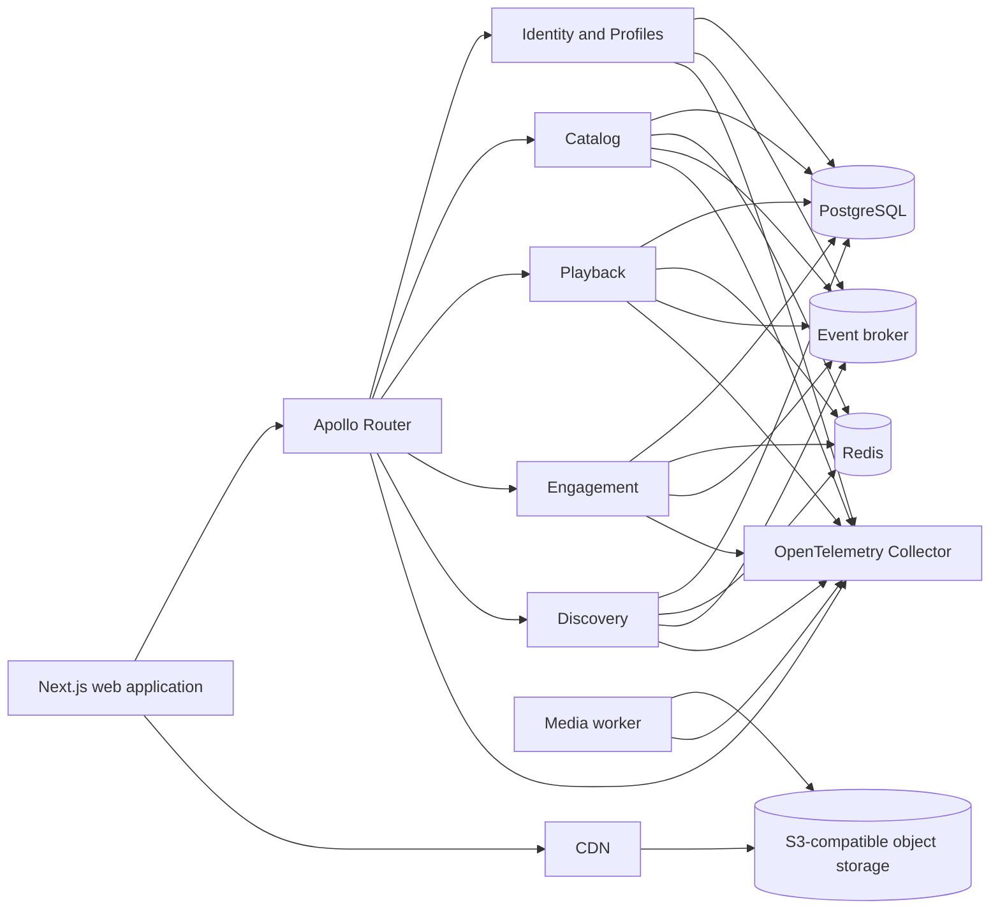

# Aster

Aster is a production-oriented video-on-demand platform for openly licensed films. It is designed as a complete engineering system rather than a collection of disconnected technical examples.

The repository begins with specifications. The implementation must remain traceable to product requirements, architecture decisions, measurable quality gates, and operational evidence.

## Current status

**The Phase 00 repository foundation and the first two Phase 01 local-platform work items are verified. P01-R03 process-start configuration is implemented locally and awaiting protected verification. [P01-R02 evidence](evidence/phase-01/local-reset.txt) covers fresh-state reset, released P01-R01 same-checkout upgrade, hosted-target refusals, hidden-resource refusal, clean recovery, and unrelated-resource preservation; application-service implementation has not started.**

Do not describe planned behavior as implemented behavior. The source of truth for current progress is [`.ai/CURRENT_STATE.md`](.ai/CURRENT_STATE.md).

## Run the current foundation

The Phase 00 checkpoint validates the repository itself. It does not start an application, expose a URL, or require Docker. The current command results are recorded in the [Phase 00 evidence index](evidence/phase-00/README.md).

### Requirements

- Git;
- Node.js `24.19.0`, selected through `.nvmrc`, `.node-version`, or an equivalent version manager;
- Corepack from the supported Node.js distribution;
- registry access for the first package-manager provisioning, dependency install, and dependency audit.

Docker, FFmpeg, databases, and hosted credentials are not required for this checkpoint.

### Bootstrap a fresh checkout

Run these commands from a POSIX shell such as Linux, macOS, WSL, or the repository's CI environment:

```bash
git clone https://github.com/andrewsrigom/aster-streaming-platform.git
cd aster-streaming-platform
git config --local core.hooksPath .githooks
node --version
corepack enable
corepack install
pnpm --version
pnpm install --frozen-lockfile
pnpm toolchain:check
```

The local Git command activates the tracked repository hooks for this clone without changing user-global configuration. `node --version` must print `v24.19.0`, and `pnpm --version` must print `11.24.0`. The frozen install rejects lockfile drift. The toolchain check rejects an unsupported active runtime or inconsistent repository pins.

### Choose the check that matches the change

Repository hooks automatically inspect only applicable staged files and the commit subject. Use the focused commands while iterating:

```bash
pnpm check:source
pnpm docs:check
pnpm ai:check
```

Before considering a Phase 00 change complete, run the authoritative local repository gate and the registry-backed vulnerability audit:

```bash
pnpm check
pnpm audit --audit-level=high
```

`pnpm check` is also the current runnable demonstration: it exercises the pinned toolchain, source policy, architecture boundaries, documentation, repository memory, community contract, secret scanning, CI policy, staged-file selection, commit policy, and their adverse tests. It intentionally does not pretend that the future video application exists.

### Clean generated foundation state

```bash
pnpm clean:foundation
```

The command validates `package.json` and `pnpm-lock.yaml`, then removes only the root `.turbo` cache and `node_modules` tree. It does not delete source, Git state, evidence, environment files, the shared pnpm store, containers, images, or volumes. Run the frozen install again before executing package scripts.

## Run the local platform checkpoint

P01-R01 provides a Docker-only status checkpoint with PostgreSQL, Redis, one-shot protocol initialization, persistent PostgreSQL state, ongoing dependency health, and no host ports. It is not an application or playable video demo.

Requirements:

- Docker Engine `26.0.0` or a newer compatible release;
- Docker Compose `2.26.1` or a newer compatible release;
- registry access the first time the immutable images are pulled.

From the repository root, start the checkpoint with one command:

```bash
docker compose --project-name aster --file infra/compose/compose.yml up --wait --wait-timeout 120 platform-status
```

The command creates only the `aster` Compose project, pulls exact multi-platform image digests when absent, waits for PostgreSQL and Redis health, requires the one-shot initializer to exit successfully, and leaves `platform-status` healthy. Inspect the result with:

```bash
docker compose --project-name aster --file infra/compose/compose.yml ps --all
docker compose --project-name aster --file infra/compose/compose.yml logs --no-color platform-init platform-status
```

Stop the checkpoint while preserving its PostgreSQL volume with:

```bash
docker compose --project-name aster --file infra/compose/compose.yml down
```

Delete the complete Aster local project, including its durable PostgreSQL volume, only with the explicit destructive reset:

```bash
ASTER_ENVIRONMENT=local ./tools/reset-local-platform.sh --confirm DELETE-ASTER-LOCAL-DATA
```

This operation is irreversible for current local data. It accepts no alternate project, path, URL, Docker endpoint override, hosted CI environment, or extra flag. It inspects the active Docker context and every discovered Aster container, network, and volume before calling the fixed project teardown, then requires zero Aster project resources afterward. It retains container images and unrelated Docker resources. Run the normal `down` command when PostgreSQL data must survive.

The explicit project name has higher precedence than an inherited `COMPOSE_PROJECT_NAME`, so every public command remains scoped to Aster. Redis is deliberately disposable and neither dependency is published to a host port. Use the detailed diagnostics and reset recovery behavior in [`docs/operations/LOCAL_DEVELOPMENT.md`](docs/operations/LOCAL_DEVELOPMENT.md).

## Validate reference runtime configuration

P01-R03 adds a server-only configuration package and process-start diagnostic. It validates explicit environment selection and the reference runtime's PostgreSQL and Redis URLs without connecting to either dependency or starting an application:

```bash
ASTER_ENV=local \
ASTER_SERVICE_NAME=config-check \
DATABASE_URL=postgresql://postgres:5432/aster \
REDIS_URL=redis://redis:6379/0 \
pnpm config:check
```

The result prints non-secret runtime values and only configured status for secret fields. Missing, empty, malformed, oversized, or unexpected owned variables fail before other initialization with exit status 1 and bounded redacted issues. Use `pnpm config:test` for the focused adverse suite and [`docs/operations/CONFIGURATION_AND_ENVIRONMENTS.md`](docs/operations/CONFIGURATION_AND_ENVIRONMENTS.md) for the complete contract.

Phase 07 owns the first clean-start playable HLS journey. There is still no supported `pnpm dev`, application URL, or playable demo command.

See [`docs/operations/LOCAL_DEVELOPMENT.md`](docs/operations/LOCAL_DEVELOPMENT.md) for command behavior, feedback lanes, and future checkpoints.

## Product scope

Aster provides:

- a browsable film catalog;
- title pages with complete rights and attribution information;
- adaptive HLS playback;
- accounts and multiple viewer profiles;
- watchlists, history, playback progress, and continue-watching;
- home rails and search;
- server-rendered public pages with client-side personalization;
- a federated GraphQL API;
- observable and resilient Node.js services;
- a reproducible media-ingestion pipeline;
- explicit performance, security, and reliability controls.

The initial catalog is built from films whose redistribution and modification rights have been verified. Blender Open Movies are candidate sources, but every asset must pass the rights workflow before ingestion.

## Architecture at a glance



## Start here

Read these files in order:

1. [`AGENTS.md`](AGENTS.md)
2. [`.ai/README.md`](.ai/README.md)
3. [`docs/00-start-here/PROJECT_CHARTER.md`](docs/00-start-here/PROJECT_CHARTER.md)
4. [`docs/product/PRODUCT_REQUIREMENTS.md`](docs/product/PRODUCT_REQUIREMENTS.md)
5. [`docs/architecture/SYSTEM_OVERVIEW.md`](docs/architecture/SYSTEM_OVERVIEW.md)
6. [`docs/00-start-here/ENGINEERING_DEMONSTRATION.md`](docs/00-start-here/ENGINEERING_DEMONSTRATION.md)
7. [`docs/specs/README.md`](docs/specs/README.md)
8. [`.ai/CURRENT_STATE.md`](.ai/CURRENT_STATE.md)
9. [`.ai/WORK_QUEUE.md`](.ai/WORK_QUEUE.md)

The next implementation unit is defined in [`docs/specs/phase-01-local-platform.md`](docs/specs/phase-01-local-platform.md). The completed foundation contract remains in [`docs/specs/phase-00-foundation.md`](docs/specs/phase-00-foundation.md).

## Repository shape

```text
apps/
  web/
  router/

services/
  identity/
  catalog/
  playback/
  engagement/
  discovery/

workers/
  media/

packages/
  config/
  contracts/
  database/
  observability/
  resilience/
  redis/
  testing/

infra/
  compose/
  observability/
  router/
  storage/

docs/
skills/
.ai/
```

This tree describes the intended implementation. Empty application directories should not be created before their phase begins.

## Delivery principles

- Build one complete vertical slice at a time.
- Keep domain rules independent from frameworks.
- Prefer explicit ownership over shared mutable models.
- Treat Redis as an optimization unless an approved decision says otherwise.
- Make timeouts, cancellation, retries, and concurrency limits explicit.
- Record evidence before claiming performance or reliability improvements.
- Keep public documentation accurate enough to operate the system.
- Do not add infrastructure only to make the architecture look larger.

## Documentation map

The complete map is in [`docs/00-start-here/DOCUMENTATION_MAP.md`](docs/00-start-here/DOCUMENTATION_MAP.md).

The progressive local demonstration and engineering-evidence contract is in [`docs/00-start-here/ENGINEERING_DEMONSTRATION.md`](docs/00-start-here/ENGINEERING_DEMONSTRATION.md). Branch, commit, CI, and verified GitHub controls are in [`docs/operations/REPOSITORY_GOVERNANCE.md`](docs/operations/REPOSITORY_GOVERNANCE.md). The public source is hosted at [andrewsrigom/aster-streaming-platform](https://github.com/andrewsrigom/aster-streaming-platform).

## License

Aster source code and project-authored documentation are available under the [MIT License](LICENSE). Media assets and third-party materials retain their own licenses and attribution requirements. See [`LICENSES.md`](LICENSES.md) and [`docs/product/CONTENT_RIGHTS.md`](docs/product/CONTENT_RIGHTS.md).
