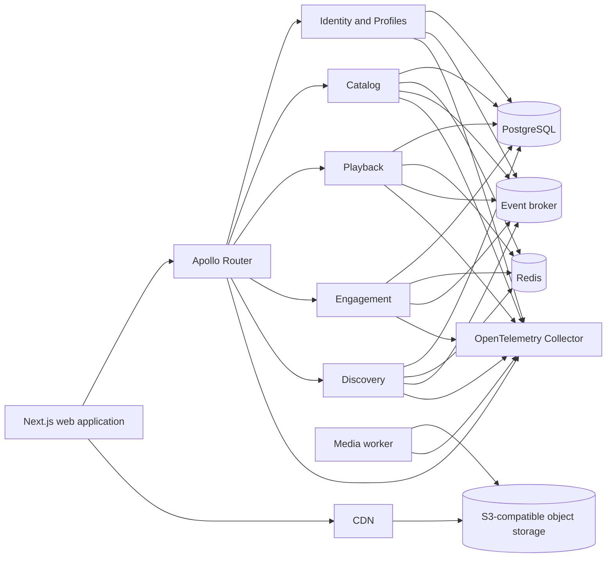

# Aster

Aster is a production-oriented video-on-demand platform for openly licensed films. It is designed as a complete engineering system rather than a collection of disconnected technical examples.

The repository begins with specifications. The implementation must remain traceable to product requirements, architecture decisions, measurable quality gates, and operational evidence.

## Current status

**Specification baseline complete. Phase 00 governance work is in progress; application implementation has not started.**

Do not describe planned behavior as implemented behavior. The source of truth for current progress is [`.ai/CURRENT_STATE.md`](.ai/CURRENT_STATE.md).

## Product scope

Aster provides:

- a browsable film catalog;
- title pages with complete rights and attribution information;
- adaptive HLS playback;
- accounts and multiple viewer profiles;
- watchlists, history, playback progress, and continue-watching;
- home rails and search;
- server-rendered public pages with client-side personalization;
- a federated GraphQL API;
- observable and resilient Node.js services;
- a reproducible media-ingestion pipeline;
- explicit performance, security, and reliability controls.

The initial catalog is built from films whose redistribution and modification rights have been verified. Blender Open Movies are candidate sources, but every asset must pass the rights workflow before ingestion.

## Architecture at a glance



## Start here

Read these files in order:

1. [`AGENTS.md`](AGENTS.md)
2. [`.ai/README.md`](.ai/README.md)
3. [`docs/00-start-here/PROJECT_CHARTER.md`](docs/00-start-here/PROJECT_CHARTER.md)
4. [`docs/product/PRODUCT_REQUIREMENTS.md`](docs/product/PRODUCT_REQUIREMENTS.md)
5. [`docs/architecture/SYSTEM_OVERVIEW.md`](docs/architecture/SYSTEM_OVERVIEW.md)
6. [`docs/00-start-here/ENGINEERING_DEMONSTRATION.md`](docs/00-start-here/ENGINEERING_DEMONSTRATION.md)
7. [`docs/specs/README.md`](docs/specs/README.md)
8. [`.ai/CURRENT_STATE.md`](.ai/CURRENT_STATE.md)
9. [`.ai/WORK_QUEUE.md`](.ai/WORK_QUEUE.md)

The first implementation unit is defined in [`docs/specs/phase-00-foundation.md`](docs/specs/phase-00-foundation.md).

## Repository shape

```text
apps/
  web/
  router/

services/
  identity/
  catalog/
  playback/
  engagement/
  discovery/

workers/
  media/

packages/
  config/
  contracts/
  database/
  observability/
  resilience/
  redis/
  testing/

infra/
  compose/
  observability/
  router/
  storage/

docs/
skills/
.ai/
```

This tree describes the intended implementation. Empty application directories should not be created before their phase begins.

## Delivery principles

- Build one complete vertical slice at a time.
- Keep domain rules independent from frameworks.
- Prefer explicit ownership over shared mutable models.
- Treat Redis as an optimization unless an approved decision says otherwise.
- Make timeouts, cancellation, retries, and concurrency limits explicit.
- Record evidence before claiming performance or reliability improvements.
- Keep public documentation accurate enough to operate the system.
- Do not add infrastructure only to make the architecture look larger.

## Documentation map

The complete map is in [`docs/00-start-here/DOCUMENTATION_MAP.md`](docs/00-start-here/DOCUMENTATION_MAP.md).

The progressive local demonstration and engineering-evidence contract is in [`docs/00-start-here/ENGINEERING_DEMONSTRATION.md`](docs/00-start-here/ENGINEERING_DEMONSTRATION.md). Branch, commit, CI, and verified GitHub controls are in [`docs/operations/REPOSITORY_GOVERNANCE.md`](docs/operations/REPOSITORY_GOVERNANCE.md). The public source is hosted at [andrewsrigom/aster-streaming-platform](https://github.com/andrewsrigom/aster-streaming-platform).

## License

Aster source code and project-authored documentation are available under the [MIT License](LICENSE). Media assets and third-party materials retain their own licenses and attribution requirements. See [`LICENSES.md`](LICENSES.md) and [`docs/product/CONTENT_RIGHTS.md`](docs/product/CONTENT_RIGHTS.md).
