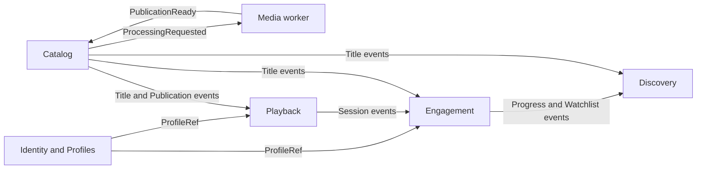

# Bounded Contexts

## Context map

Arrows describe contracts, not table access.

## Identity and Profiles

### Owns

- accounts;
- authentication adapter mapping;
- sessions or identity linkage;
- viewer profiles;
- profile ownership;
- profile locale and maturity preferences;
- account-level profile limits.

### Does not own

- watchlists;
- progress;
- history;
- title metadata;
- playback authorization rules;
- recommendation models.

### Federation entities

- `Account`
- `Profile`

Other contexts reference `Profile` by stable ID and verify authorization through request identity or an explicit Identity policy.

## Catalog

### Owns

- title editorial metadata;
- credits, genres, languages, artwork references;
- rights records;
- title lifecycle;
- publication association;
- public availability status;
- attribution data.

### Does not own

- processing execution;
- playback sessions;
- viewer progress;
- personalized ordering.

### Federation entities

- `Title`
- `MediaPublication`

Catalog is the only context that can mark a title published or retired.

## Playback

### Owns

- playback-session lifecycle;
- session expiry;
- publication delivery references;
- playback capability decisions;
- session-level playback telemetry intake;
- delivery policy abstraction.

### Does not own

- title editorial state;
- raw media processing;
- durable viewing progress;
- watchlist;
- search.

Playback consumes a publication projection from Catalog events for efficient lookup. Creating a new playback session still performs a bounded owner-authoritative current-state check with Catalog. Catalog unavailability fails session creation closed; a stale projection never overrides retirement, dispute, or rights state.

## Engagement

### Owns

- playback progress;
- progress sequence and idempotency;
- completion status;
- watchlist;
- viewing history;
- continue-watching query model.

### Does not own

- title metadata;
- account/profile lifecycle;
- playback session issuance;
- general recommendation ranking.

Engagement extends federated `Title` and `Profile` entities with profile-specific fields.

## Discovery

### Owns

- home-rail definitions;
- search indexing or search read models;
- editorial and computed ordering;
- trending projection;
- recommendation extension when enabled;
- degradation policy for optional rails.

### Does not own

- title truth;
- progress truth;
- profile truth;
- playback availability.

Discovery can be stale or unavailable without invalidating the source contexts.

## Media worker

Media processing is not a viewer-facing bounded context. It is a technical capability with explicit contracts.

### Owns

- processing execution;
- source acquisition attempts;
- probe output;
- processing recipes;
- temporary workspace;
- generated object checksums;
- technical validation reports.

### Does not own

- legal approval;
- title publication state;
- editorial metadata;
- playback authorization.

Catalog requests processing only after rights approval. The worker reports a validated publication candidate; Catalog decides whether to publish it.

## Shared kernel policy

Only these may be shared:

- scalar wire types;
- event envelope;
- trace propagation;
- configuration primitives;
- result/error primitives;
- test utilities;
- infrastructure adapters with no domain vocabulary.

Domain entities, repositories, use cases, and database models are not shared.
