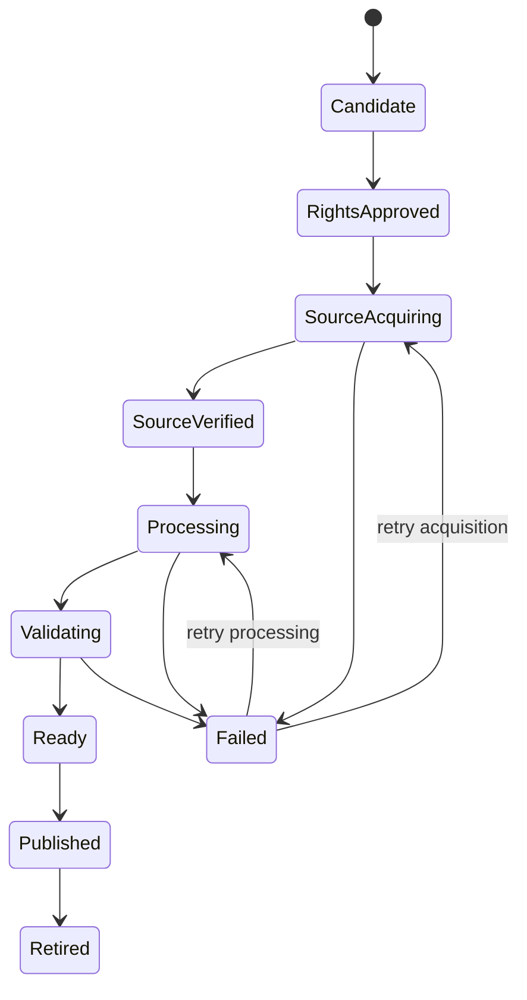

# Media Pipeline

## Responsibility split

Catalog owns legal and editorial approval. The media worker owns technical processing. Playback owns session and delivery policy. Object storage owns bytes. The CDN handles high-bandwidth distribution.

## State model



Catalog lifecycle and processing lifecycle are related but separate. A technically ready publication does not publish itself.

## Source acquisition

The worker receives a processing request referencing an approved rights record and source URL.

It:

1. validates the request version and idempotency identity;
2. streams the source into an isolated temporary file or multipart upload;
3. enforces maximum bytes and duration expectations;
4. calculates a cryptographic checksum;
5. captures response metadata and redirects;
6. verifies file signature and probes streams;
7. stores the immutable original under a content-addressed or versioned path;
8. records source evidence.

## Processing recipe

A recipe is versioned configuration containing:

- allowed source codecs and containers;
- video ladder rules;
- audio normalization and rendition rules;
- subtitle conversion;
- segment length;
- keyframe alignment;
- thumbnail and poster extraction;
- FFmpeg arguments;
- validation thresholds.

Reprocessing the same checksum with the same recipe is idempotent.

## Initial video ladder

The actual ladder is derived from source resolution, frame rate, motion, and measured quality. A conservative starting set may include:

- 360p;
- 540p;
- 720p;
- 1080p when the source supports it.

Never upscale. Encode settings must be benchmarked for available compute and browser support.

The first release may use H.264 and AAC for broad compatibility. Additional codecs require a device-support and storage/compute cost decision.

## HLS layout

```text
media/
  titles/{titleId}/
    sources/{sourceChecksum}/original.{ext}
    publications/{publicationId}/
      master.m3u8
      video/{renditionId}/playlist.m3u8
      video/{renditionId}/segment-000001.m4s
      audio/{language}/{renditionId}/playlist.m3u8
      subtitles/{language}/subtitles.vtt
      images/poster-{width}.webp
      images/thumb-{timestamp}-{width}.webp
      technical-report.json
      attribution.json
```

Publication prefixes are immutable.

## Validation

Technical validation checks:

- master and child playlist syntax;
- every referenced object exists;
- segment sequence continuity;
- expected codecs;
- dimensions and frame rate;
- audio channels and language metadata;
- duration tolerance;
- caption parsing and cues;
- no unexpected streams;
- first and last segment decodability;
- output checksum manifest;
- representative browser playback.

## Atomic publication

The worker reports `MediaPublicationReady` with immutable identifiers and validation evidence.

Catalog verifies:

- rights record still approved;
- title is eligible;
- publication report matches request;
- required accessibility and editorial fields exist.

Catalog then stores the active publication and state transition in one transaction. Stable caches are invalidated after commit.

## Failure and cleanup

- Temporary files are cleaned after success or terminal failure.
- Failed attempts retain bounded diagnostics.
- Partial outputs remain private and are deleted by lifecycle policy.
- Retries use attempt identity and do not overwrite immutable outputs.
- Cancellation kills the FFmpeg process tree and cleans temporary resources.
- Resource exhaustion is a classified failure, not an infinite retry.

## Delivery

Playback issues a short-lived session and returns a delivery reference. Clients request the HLS master and segments from CDN.

The CDN and object storage need correct:

- MIME types;
- CORS;
- range support where relevant;
- immutable caching for versioned objects;
- short caching for stable pointers;
- origin protection;
- observability for manifest and segment errors.
