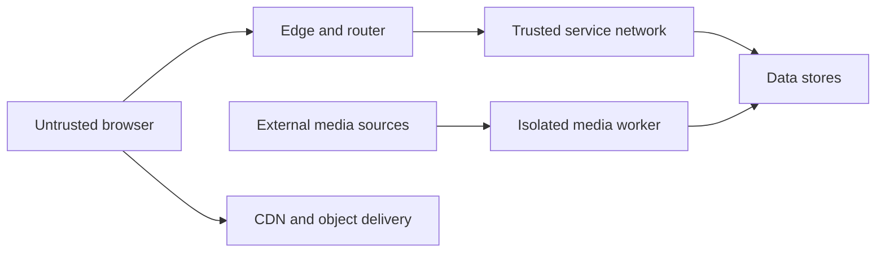

# Security Architecture

## Trust boundaries

Every boundary validates identity, input shape, size, time, and authority appropriate to the operation.

## Identity propagation

The public client authenticates through the chosen identity adapter. The edge creates or validates a trusted request identity containing minimal claims.

Subgraphs accept identity context only from the router or trusted server path. They do not trust public `x-user-id`, `x-profile-id`, or role headers.

Service-to-service identity and key rotation are finalized before hosted release.

## Authorization model

- Identity verifies account-to-profile ownership.
- Catalog protects draft, rights, processing, and publication operations with operator policy.
- Playback verifies publication and profile ownership when needed.
- Engagement verifies ownership for every profile-scoped read and mutation.
- Discovery receives only approved profile context and does not become an authorization authority.

Authorization decisions produce auditable stable outcomes without logging secrets.

## GraphQL abuse model

Threats include:

- deeply nested queries;
- alias amplification;
- expensive list fan-out;
- oversized variables;
- parser exhaustion;
- repeated mutations;
- batching abuse;
- introspection reconnaissance;
- identifier substitution;
- cache poisoning;
- error detail leakage.

Controls are layered at edge, router, schema, resolver, application, and dependency levels.

The public Router now compares the exact name and SHA-256 document of every
request with source-generated first-party artifacts. Hosted `enforce` mode
rejects missing, unknown and altered operations before planning; explicit
local/integration `audit` mode preserves bounded development queries. Only the
finite match result enters telemetry. This reduces the public document surface
but does not authorize a user or replace owner-side identifier, role and profile
checks. Composition now gives every exact current or retained operation
a bounded source-owned profile using owner `@cost` and `@listSize` metadata. It
fails publication on excessive depth, aliases, roots, selections, list
expansion, weighted cost or missing metadata. Version-2 profiles also derive the
minimum authorization scope, require one reviewed rate class and bind all
responses to `no-store`. Identity profile commands partition rate admission by
the account from a current owner session; only SHA-256 account/admission
pseudonyms enter Redis. A retained durable receipt replays before the shorter
limiter marker can reject it, while new writes repeat authorization in the base
command. Expired local retry markers are pruned before their finite capacity is
enforced, so healthy Redis traffic cannot disable later bounded failover.
Router still rejects oversized or parser-hostile bodies, bounds execution
to three seconds/eight concurrent requests, overwrites response cache control,
and disables batching and introspection. N+1/query-count and final
owner-authorization abuse proof now exist in the dependent Phase13 closing
candidate:12 exact negative cases cover identifier substitution, cross-profile
access and role/private-transport escalation across all five owners. The matrix
points to executable owner tests and the Router verifies every reference. It is
not released until the ordered predecessor and candidate gates pass. Neither
demand nor rate admission grants authority.

## Media threat model

Threats include:

- misleading extension or MIME type;
- malformed container;
- decompression or decode bomb;
- excessive duration or dimensions;
- unexpected streams;
- command injection;
- path traversal;
- temporary-disk exhaustion;
- CPU/memory exhaustion;
- poisoned subtitle or metadata;
- public exposure of originals;
- incomplete manifest publication.

The worker runs with no shell interpolation, least privilege, resource limits, isolated temporary storage, restricted network access, and bounded outputs.

## Object storage

- Originals are private.
- Worker credentials can write only intended prefixes.
- Playback services cannot overwrite media.
- CDN origin access is restricted.
- Stable public URLs point only to validated publications.
- Administrative listing is not exposed publicly.
- Lifecycle rules do not delete active publication objects.
- Audit logs are enabled in hosted environments.

## Data protection

The initial product minimizes personal data. Profile data and viewing history receive retention, access, export, and deletion policies before release.

Logs and metrics use pseudonymous or aggregate context. Raw progress events are retained only as required by product and recovery needs.

## Supply chain

CI performs:

- lockfile integrity;
- secret scanning;
- dependency review;
- static analysis;
- container scanning;
- generated software bill of materials;
- provenance or signing where supported.

New dependencies require a reason, maintenance check, license review, and runtime-impact review.

## Threat-model cadence

Update the threat model when:

- adding an entry point;
- adding file or URL ingestion;
- changing identity;
- moving a field between subgraphs;
- introducing trusted operations;
- changing object delivery;
- collecting new personal data;
- adding an operator function;
- changing deployment network boundaries.
