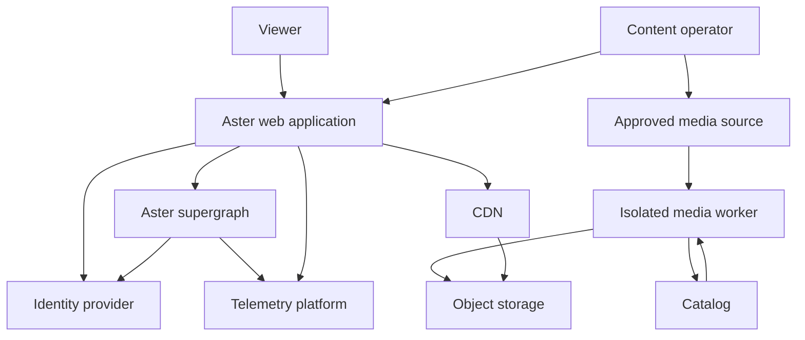
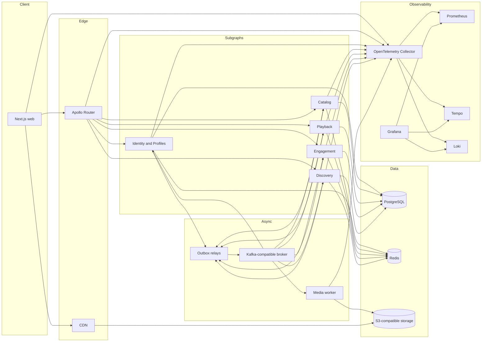

# System Overview

## Architectural intent

Aster separates product ownership into five bounded contexts while exposing one application API through Apollo Federation v2. Media bytes follow a separate delivery path through object storage and a CDN.

The initial implementation is distributed enough to exercise real contracts and failure boundaries, but it avoids creating infrastructure without a product reason.

## Context view



## Container view



## Request paths

### Catalog page

```text
browser
→ Next.js server rendering
→ Apollo Router
→ Catalog subgraph
→ Redis cache
→ PostgreSQL on miss
→ composed response
→ HTML and Apollo snapshot
→ browser hydration
```

### Profile home

```text
browser
→ Apollo Router
→ parallel fetch plans
   → Catalog editorial rails
   → Engagement continue-watching
   → Discovery computed rails
→ partial or fallback response according to field semantics
```

### Playback start

```text
browser
→ Playback mutation
→ bounded current-publication check at Catalog, using a local projection only as an optimization
→ short-lived playback session
→ manifest URL
→ browser requests media through CDN
```

Video segments never flow through the GraphQL router or Node.js subgraphs.

If Catalog cannot confirm current publication state before the request deadline, Playback fails closed and does not issue a new session. Existing short-lived sessions follow their expiry policy.

### Progress update

```text
player
→ Engagement mutation
→ authorization
→ idempotency and monotonic sequence check
→ PostgreSQL transaction
→ outbox event
→ response
→ asynchronous projections and analytics
```

### Media publication

```text
approved rights record
→ source acquisition
→ immutable original
→ FFmpeg probe
→ rendition generation
→ HLS packaging
→ technical validation
→ immutable publication version
→ Catalog publication transaction
→ cache invalidation event
```

## Deployment units

Initial units:

- `web`
- `router`
- `identity-subgraph`
- `catalog-subgraph`
- `playback-subgraph`
- `engagement-subgraph`
- `discovery-subgraph`
- `media-worker`
- `outbox-relay` per context or a shared executable configured per owner
- local observability stack

Shared packages provide cross-cutting adapters and contracts. They do not contain shared domain models.

## Consistency model

- Account/profile ownership: strong within Identity.
- Title lifecycle and rights: strong within Catalog.
- Playback session creation: strongly checks a current publication view.
- Progress ordering: strong per profile and title.
- Watchlist mutation: strong and idempotent.
- Home rails: eventual and allowed to be stale within documented limits.
- Cross-context projections: eventual through events.
- Telemetry: best effort with bounded buffering.

## Availability priorities

1. Published media delivery
2. Playback-session creation
3. Catalog/title reads
4. Progress writes
5. Profile selection
6. Continue-watching
7. Search and home personalization
8. Administrative media workflows

Optional discovery behavior must not consume the availability budget of playback.

## Current versus scale-out architecture

The initial release may run all PostgreSQL schemas in one cluster, all Redis keyspaces in one deployment, and all services in one region. Ownership remains logical and enforced by credentials and code boundaries.

The scale-out documents describe evolution triggers. They are not claims about the initial deployment.
