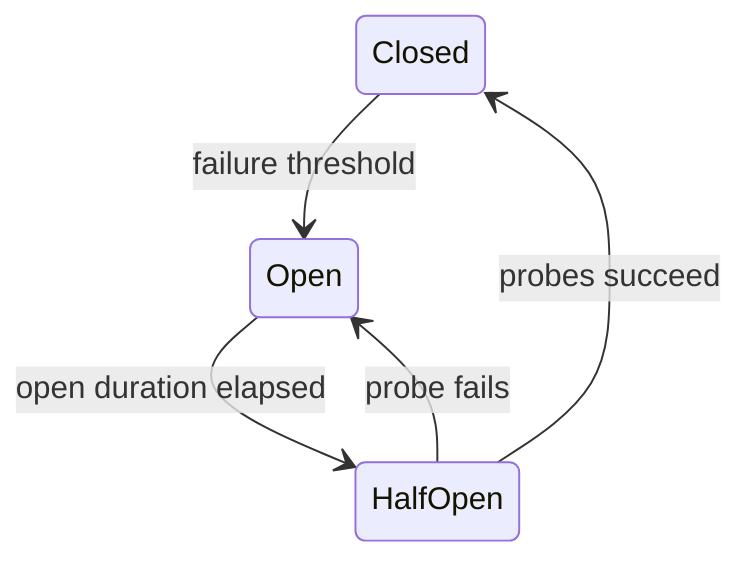

# Resilience

## Purpose

Resilience does not mean making every request eventually succeed. It means controlling failure so the system spends a bounded amount of time and capacity, preserves correctness, and provides the best safe outcome.

## 1. Start with the user journey

For `HomeQuery`, Catalog is important and Discovery personalization is optional.

For `CreatePlaybackSession`, current publication state is critical. Recommendation data is irrelevant.

For `RecordProgress`, durable acceptance is critical. Returning success from an in-memory fallback would be incorrect.

Policy follows semantics.

## 2. Timeout versus deadline

An attempt timeout might allow 200 ms for one Redis call. An overall request deadline might allow 800 ms for all work.

Without deadline propagation:

```text
router timeout
+ subgraph retries
+ database timeout
+ client retry
```

can multiply latency and load.

Aster propagates remaining time and reserves response overhead.

## 3. Retries

A retry is a new load request sent while a dependency may already be unhealthy.

Retry only when:

- failure is likely transient;
- operation is idempotent or protected;
- remaining deadline allows it;
- attempts are bounded;
- backoff has jitter;
- all layers do not repeat the same policy.

### Safe examples

- a catalog read after a transient connection reset;
- an object metadata read;
- publishing an outbox event by stable event ID.

### Unsafe without protection

- creating a profile;
- recording progress;
- publishing a media version;
- deleting data.

These can become safe through idempotency keys or durable constraints.

## 4. Exponential backoff with jitter

Conceptual schedule:

```text
delay = min(cap, base × 2^attempt)
actual = random(0, delay)
```

Full jitter reduces synchronized retry waves. The exact formula is less important than bounded total attempts and measured behavior.

## 5. Circuit breaker

States:



A breaker protects capacity and shortens predictable failure. It does not fix the dependency.

Scope matters. If search is failing, a breaker should not necessarily block a cheap title lookup on the same host.

Track:

- calls allowed and rejected;
- state;
- failure categories;
- open duration;
- probe result;
- fallback result.

## 6. Bulkheads

A bulkhead limits the blast radius of slow work.

Examples:

- maximum concurrent Discovery requests;
- separate media-worker slots from request compute;
- bounded Redis refresh concurrency;
- bounded event consumer concurrency;
- database pool limits.

Define what happens when full:

- reject;
- queue briefly;
- return stale;
- use fallback;
- pause consumption.

Never use an infinite queue.

## 7. Fallbacks

A valid fallback preserves safety and honest semantics.

Good:

- editorial titles instead of unavailable recommendations;
- bounded stale catalog metadata when rights freshness permits;
- native HLS playback where browser support exists.

Bad:

- allowing access when authorization is unavailable;
- acknowledging unsaved progress;
- playing a disputed title from cache;
- returning an empty home and calling it success without degradation signal.

## 8. Idempotency

An idempotency record typically stores:

- operation scope;
- caller;
- key;
- request fingerprint;
- status;
- result reference;
- expiry or retention.

If the same key arrives with a different request fingerprint, return conflict rather than replaying an unrelated result.

The database transaction must couple idempotency acceptance and state change.

## 9. Failure injection

Inject at adapters, not scattered business code.

Useful modes:

```text
latency
timeout
connection reset
transient error
permanent error
malformed response
partial stream
duplicate event
reordered event
resource saturation
```

Controls require environment gating, authentication, audit, and obvious telemetry.

## 10. Policy composition example

```text
overall deadline
└─ bulkhead
   └─ breaker
      └─ retry loop
         └─ attempt timeout
            └─ dependency call
```

Reasons:

- deadline bounds everything;
- bulkhead prevents queue explosion;
- breaker avoids work known to fail;
- retries occur only while allowed;
- each attempt is bounded.

Other operations may need a different composition. Record it.

## 11. Validation scenarios

Aster validates:

- dependency fails immediately;
- dependency exceeds timeout;
- first attempt fails and second succeeds;
- all attempts fail;
- deadline expires before another attempt;
- breaker opens and recovers;
- queue fills;
- fallback succeeds and fails;
- caller cancels;
- process terminates during work;
- duplicate mutation arrives after unknown response.

Resilience is verified through traces and load, not only unit tests.
