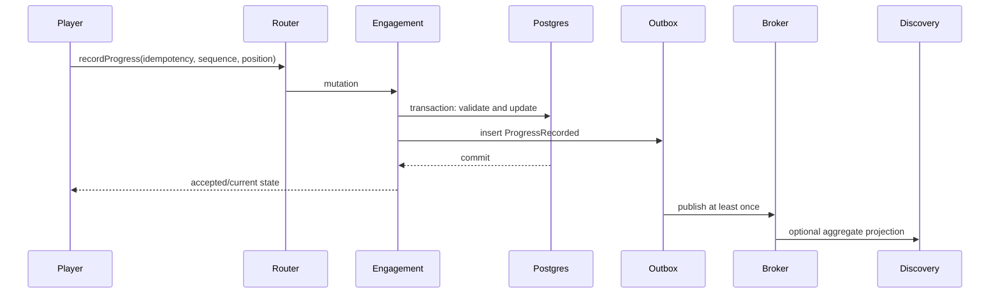

# System Design: Continue-Watching

## Requirements

- Save current position for an authenticated profile.
- Never move backward because an older update arrived late.
- Treat duplicate delivery safely.
- Resume across sessions.
- Remove completed items from continue-watching.
- Keep history.
- Return a recent bounded list quickly.
- Respect profile deletion.
- Continue playback even if optional projections fail.
- Provide honest durability semantics.

## Initial design



Engagement owns the authoritative progress and continue-watching query.

## Durable model

Key:

```text
(profile_id, title_id)
```

Fields:

- latest accepted sequence;
- position;
- duration;
- completion;
- last playback session;
- first started;
- last updated;
- aggregate version.

Idempotency records store key, request fingerprint, result, and retention.

## Acceptance logic

1. authenticate account;
2. verify profile ownership;
3. validate playback context;
4. validate position/duration;
5. find idempotency record;
6. if duplicate with same fingerprint, return prior result;
7. if key collision with different fingerprint, conflict;
8. lock or conditionally update aggregate;
9. reject sequence not greater than current;
10. apply resume/completion policy;
11. write history and outbox in transaction;
12. commit;
13. acknowledge.

## Client reporting

Report:

- on bounded interval while playing;
- after meaningful seek;
- on pause;
- before route transition when possible;
- on ended.

Browser unload delivery is not guaranteed. Frequent interval updates limit loss.

The client sequence is monotonic per playback session. The server's accepted sequence logic accounts for new sessions through an explicit session epoch or compound ordering design.

## Query

Continue-watching sorts by recent accepted activity and excludes:

- below opening threshold;
- completed;
- retired/disputed titles through current Catalog contribution;
- deleted profile data.

Use keyset pagination:

```text
(last_activity_at DESC, title_id DESC)
```

Federation contributes current title metadata in batches.

## Cache

A profile response may be cached briefly or locally assembled, but PostgreSQL remains authoritative.

Progress acceptance invalidates or version-bumps the profile cache. Cache outage reconstructs from durable state.

## Larger-scale evolution

At a much larger write rate:

```text
player
→ regional progress ingest
→ partitioned log by profile/title
→ compactor
→ durable progress store
→ continue-watching read model
```

Questions before adopting:

- Is acknowledgement before compaction acceptable?
- How is monotonic sequence enforced across regions?
- What happens during a partition?
- How quickly must another device see progress?
- How is deletion propagated?
- How is event replay bounded?
- What is the hot-profile behavior?

The initial synchronous durable mutation is simpler and provides clear acknowledgement semantics.

## Failure behavior

- Engagement unavailable: player continues; save fails visibly or retries within bounds.
- Duplicate: return accepted current state.
- Stale: return current state and do not overwrite.
- Broker unavailable: progress commits and outbox grows within capacity.
- Catalog stale: continue-watching may temporarily include metadata that current Catalog filters during composition.
- Redis unavailable: read/write correctness remains.

## Capacity

At `V` active viewers and interval `I`:

```text
progress reports per second = V / I
```

A synchronization burst can exceed the average. Load tests include aligned intervals, retries, pause/seek bursts, and multiple devices.

## Observability

- accepted, duplicate, stale, invalid, unauthorized;
- write latency;
- lock/constraint conflict;
- sequence gap sample;
- outbox age;
- continue-watching read latency;
- projection/cache freshness;
- client save failure;
- cross-device resume success test.
