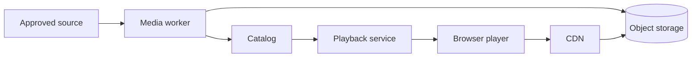

# System Design: Media Delivery

## Requirements

- Adaptive VOD playback.
- Broad browser compatibility.
- Validated immutable publications.
- Low origin load.
- Global delivery path.
- Rights-compatible controls.
- No application-server media proxy.
- Rollback to previous publication.
- Playback quality telemetry.

## Architecture



## Object policy

### Original

- private;
- immutable;
- checksum-addressed or versioned;
- limited worker and operator access;
- retained according to rights and recovery policy.

### Publication

- immutable version prefix;
- validated before active;
- long cache for versioned segments;
- correct MIME and CORS;
- protected from lifecycle deletion while active.

### Stable references

If used, stable references point to immutable version or are produced through Catalog/Playback. They use short caching and controlled invalidation.

## Origin protection

- CDN accesses origin through restricted credentials or origin policy;
- public listing disabled;
- originals inaccessible;
- application credentials cannot overwrite publication objects;
- worker credentials limited to processing prefixes;
- audit object changes.

## Playback URL policy

Open media may be public at immutable CDN paths. Playback session still provides version, telemetry, and current publication decision.

Signed URLs or cookies require:

- short lifetime;
- cache compatibility;
- no leakage into telemetry;
- rights review;
- clear failure behavior.

## Failure cases

### Missing segment

Validation should prevent it. Post-publication loss triggers rollback or restore.

### CDN outage

Evaluate alternate delivery or provider failover only if the SLO requires it. A public origin bypass can overload storage and weaken protection.

### Origin unavailable

Cached segments may continue. New or uncached requests fail. Monitor edge hit and origin dependency.

### Bad publication

Catalog switches to a previous validated immutable version.

### Rights dispute

Catalog retires title and stops new sessions. Stable discovery references are invalidated. Licensed copies already delivered may remain governed by their license; operational action must not misrepresent legal control.

## Capacity

Bandwidth:

```text
concurrency × average bitrate
```

Segment request rate:

```text
concurrency / segment duration
```

Origin request rate:

```text
edge request rate × (1 - cache hit ratio)
```

Storage:

```text
original + sum(renditions) + audio + subtitles + images + evidence
```

## Quality of experience

Measure:

- session-to-manifest;
- manifest-to-first-frame;
- selected initial rendition;
- average delivered bitrate;
- rebuffer ratio;
- fatal errors;
- rendition switches;
- completion.

Correlate with CDN status and bounded client dimensions.

## Evolution

- add a second codec after device and cost evidence;
- use multi-CDN only when availability and egress economics justify operation;
- use regional origins when origin latency or resilience requires it;
- add DRM only for content whose rights and product model require and permit it;
- add live packaging as a separate extension, not by weakening VOD invariants.
